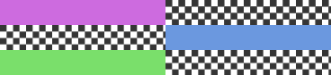
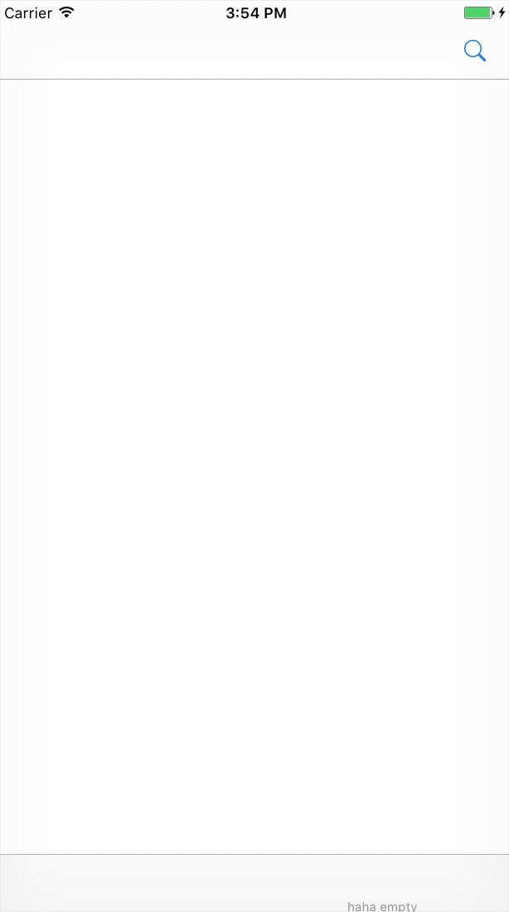

<p align="center">

<br>
RainbowTransition
<br>
<pre align="center">An easy way to change backgroundColor of UINavigationBar when Push & Pop, or scrolling a scrollview</pre>
</p>

Base on project [ETNavBarTransparent](https://github.com/EnderTan/ETNavBarTransparent)
---


Features
---
- [x] customizing navigationbar's background alpha  between controllers
- [x] changing navigationbar's background alpha associate with scrollview optionally
- [x] sending `setNeedsStatusBarAppearanceUpdate` for customizing `statusbar`

⚠️Caveat
---
- [x] disable fullscreen pop gesture in viewcontroller that needs transition

Usage
---
```swift
    navigationController.enableRainbowTransition()
```
watch demo project for more


Demo
---
<p align="center">

</p>
install
---

###Carthage
```
github "CodeEagle/RainbowTransition"
```
---

RainbowTransition is released under the MIT license. See LICENSE for details.
